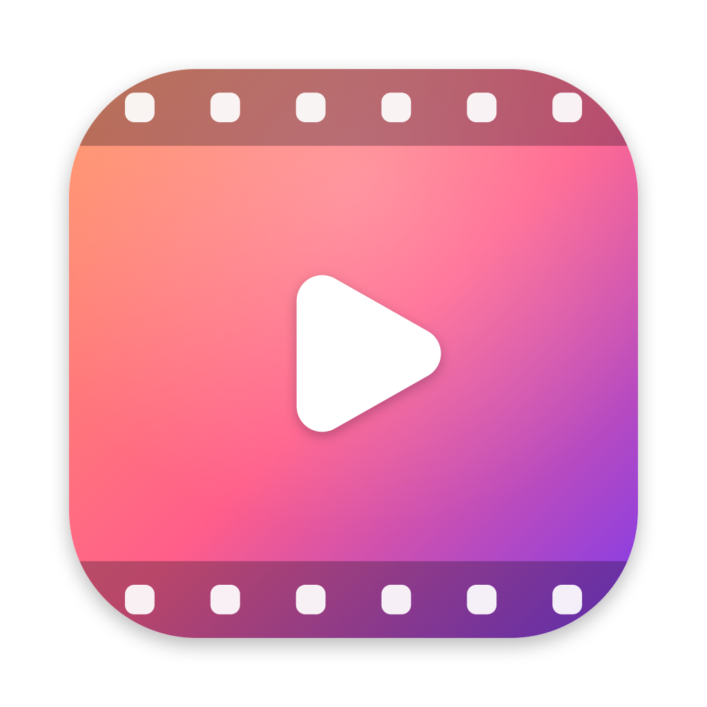
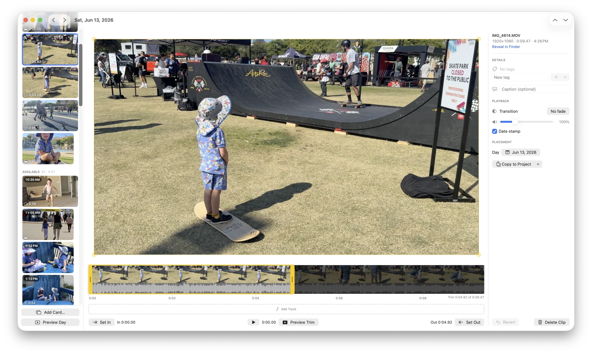

<div align="center">



# ClipDiary

**A video journal app for macOS — the “1 second a day” idea, rebuilt as a native
Mac app.**

Pick a moment from each day and render the month into a single memory video.
Free, open source, and everything stays on your Mac.

[**Download for macOS**](https://github.com/alejandromarcu/ClipDiary/releases/latest/download/ClipDiary.dmg)
 · [Website](https://clipdiary.app/)
 · [Coming from 1 Second Everyday?](https://clipdiary.app/1-second-everyday-alternative-for-mac/)
 · [Changelog](CHANGELOG.md)



</div>

## What it is

[1 Second Everyday](https://1se.co/) (1SE) is lovely, and phone-only. ClipDiary
is a desktop take on the same daily-video-diary habit, written in SwiftUI for a
big screen and a keyboard — built for personal use, then made public because it
turned out to be worth sharing.

Deliberate differences from 1SE:

- **Clips can be any length.** No ~10 second ceiling, and a day can hold several.
- **Trim both ends.** Drag in- and out-points along a filmstrip instead of
  picking a start time plus a fixed duration.
- **No accounts, no cloud, no telemetry.** A project is a plain folder you chose.

## Features

- **Calendar over your own folders.** Point ClipDiary at the folders where your
  videos and photos pile up; it indexes them by capture date, and each day shows
  what you shot. Nothing is copied until you pick it.
- **Day-at-a-time reviewing.** Flip through a day's footage, trim, crop, tag,
  add — mouse or keyboard, whichever is faster.
- **Filmstrip trimming.** Frame-accurate in/out points, non-destructive: your
  media files are never modified, edits live as metadata.
- **Soundtracks.** A timeline of audio tracks across your days, each with its own
  trim, volume and fades. Music plays on over silent photos.
- **Photos, title cards and date stamps.** Mix in stills, design cover/ending
  cards that re-render wherever they're used, and keep or drop the classic
  burned-in date stamp.
- **Render any range.** A month, a year, everything, or a custom span — exported
  as an MP4.
- **Import an existing 1SE library.** From the official 1SE data export (exact
  dates and captions) or from a finished mashup video, which is split back into
  per-day clips by reading its burned-in date stamp.

## Install

Download [`ClipDiary.dmg`](https://github.com/alejandromarcu/ClipDiary/releases/latest/download/ClipDiary.dmg)
and drag the app into Applications.

Requires **macOS 15 (Sequoia) or later**. The build is universal (Apple silicon
and Intel).

The app is signed with an Apple Developer ID certificate and notarized by
Apple, so it opens without a Gatekeeper warning.

## How it works

1. **Create a project** — a folder anywhere you like. It holds the clips you pick
   plus a small `clips.json` of your edits.
2. **Add source folders** — your camera dumps, phone exports, whatever. They're
   scanned recursively and sorted by capture date.
3. **Open a day** — review what you shot, trim what's worth keeping, add it.
4. **Create Video** — choose a range, add music and cards, save the MP4.

## Your data

A project folder is readable without ClipDiary: copied media in `Clips/`, music
in `Audio/`, cards in `Cards/`, and every edit (trim, crop, tags, date, caption)
in `clips.json`. Trims and crops are metadata, so the original bytes are
untouched. `Thumbnails/` is a disposable cache. Nothing is uploaded anywhere —
there is no server to upload to.

## Build from source

```bash
xcodebuild -scheme ClipDiary build
```

Swift and SwiftUI only, no third-party dependencies. `CLAUDE.md` documents the
architecture file by file.

## Contributing

Bug reports and ideas are welcome in
[issues](https://github.com/alejandromarcu/ClipDiary/issues). This is a personal
tool first, so features that keep it simple win over configurability.
